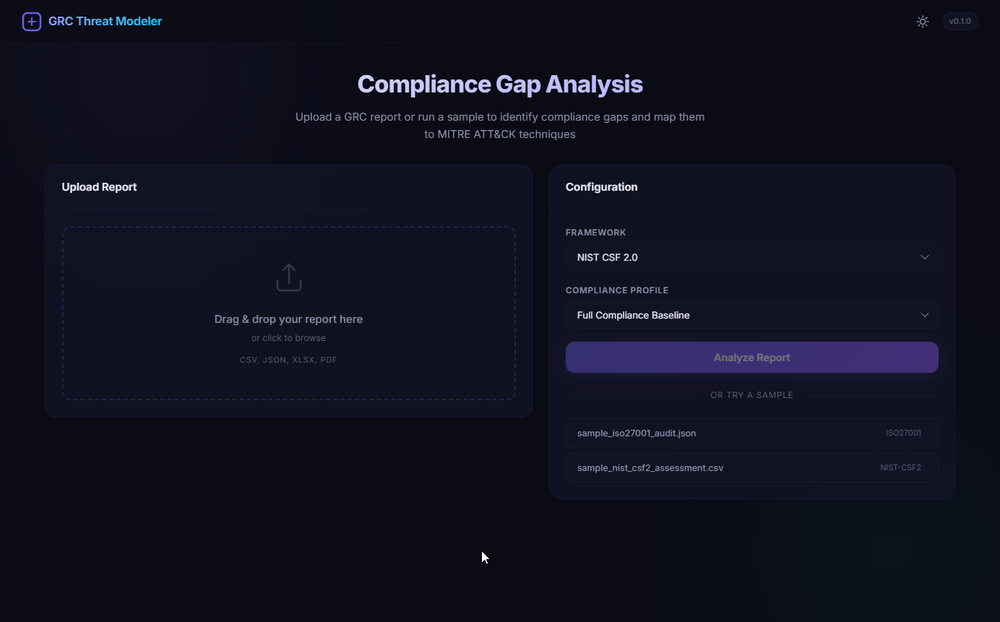
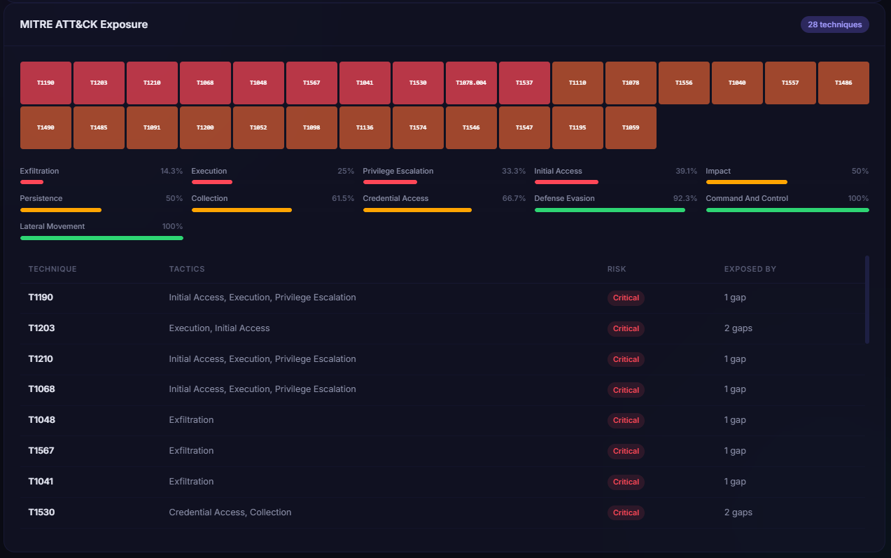

# GRC Threat Modeler

An automated Governance, Risk, and Compliance (GRC) analysis platform designed to identify compliance gaps and map them to MITRE ATT&CK techniques. This tool provides security professionals with a prioritized remediation roadmap based on framework requirements and threat exposure.

## Key Features

- **Automated Gap Analysis**: Parses compliance reports (CSV, JSON, XLSX) to identify missing or partial controls.
- **MITRE ATT&CK Mapping**: Automatically correlates compliance failures with specific adversary techniques and tactics.
- **Executive Reporting**: Generates automated summaries, maturity scoring, and risk posture assessments.
- **Remediation Roadmap**: Prioritizes actions based on control tier (Required vs. Desired) and technical severity.
- **Portable Desktop Interface**: Runs as a native application with a high-fidelity glassmorphism dashboard.

## Dashboard Overview


*Executive overview featuring compliance scoring, maturity levels, and critical findings.*


*Threat exposure visualization mapping compliance gaps to adversary tactics.*

## System Requirements

- Python 3.9 or higher
- Windows 10/11 (for Desktop Application)

## Dependencies

The core application relies on the following Python libraries:

- **Flask**: Web backend and internal API.
- **Pandas**: Data processing and report parsing.
- **Pywebview**: Native desktop window integration.
- **Openpyxl**: Excel file support.
- **Stix2**: MITRE ATT&CK data handling.
- **Jinja2**: HTML templating engine.
- **PyInstaller**: Standalone executable packaging.

## Installation

1. Clone the repository:
   ```bash
   git clone https://github.com/ramtin2e/GRCA.git
   cd GRCA
   ```

2. Create and activate a virtual environment:
   ```bash
   python -m venv venv
   .\venv\Scripts\activate
   ```

3. Install required packages:
   ```bash
   pip install -r requirements.txt
   pip install pywebview pyinstaller
   ```

## Usage

### Development Mode
To run the application in a local window for testing or development:
```bash
python desktop_launcher.py
```

### Build Portable Executable
To package the application into a standalone `.exe` file:
```bash
python package_app.py
```
The resulting executable will be located in the `dist/` directory.

## Architecture

The project is structured into modular components:

- **src/analyzers**: Core logic for scoring, executive summaries, and gap analysis.
- **src/mappers**: Framework-to-ATT&CK correlation engine.
- **src/parsers**: Unified interface for various report formats.
- **web/static**: Modern frontend built with Vanilla JS and CSS variables.
- **data/mappings**: JSON definitions for framework mappings and technique metadata.

## License

This project is intended for professional portfolio demonstration and security research purposes.
